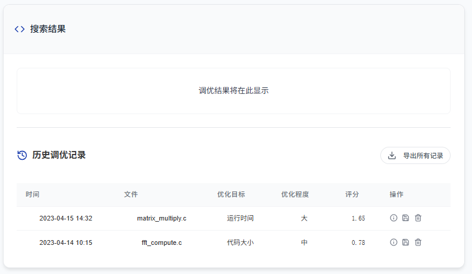

编译器参数自动调优工具

本项目为国产超算平台构建的 GCC 编译器优化参数智能调优工具，结合 Vue 前端和 Java Spring Boot 后端，实现了编译参数自动推荐、调优效果可视化等核心功能。

## 项目结构

```
compiler-optimizer/
├── frontend/   # Vue 3 + Composition API 实现的前端页面
├── backend/    # Spring Boot 实现的后端接口
├── README.md   # 项目说明文件
├── .gitignore  # Git 忽略配置
```

## 功能介绍

- 支持 `.c/.cpp` 文件上传
- 支持设置优化目标（代码大小 / 运行时间）
- 支持优化等级设定与专家选项
- 提供编译参数推荐结果
- 返回优化前后运行时间与评分对比
- 支持导出调优结果与查看历史记录

## 界面展示

本项目仅完成功能导航中的第一个部分


主要功能分为三部分：文件上传、参数选择和结果调优

1.文件上传


2.参数调优


3.结果展示



## 技术栈

- 前端：Vue 3, Composition API, Vite
- 后端：Spring Boot, Maven
- 构建工具：Node.js, Java 17
- 部署建议：Docker + Nginx

## 快速开始

### 后端启动

```bash
cd backend
./mvnw spring-boot:run
```

### 前端启动

```bash
cd frontend
npm install
npm run dev
```

## 接口文档

后端接口文档详见 `/接口api.md`，支持导入 Swagger / Apifox。

## 项目作者

维护人：@L_c_ze@163.com

## License

本项目采用 MIT License 许可。
